<!--
  ======================================================================
  SUMIT PRAJAPATI - PREMIUM PORTFOLIO & GITHUB PROFILE
  ======================================================================
  Designed and handcrafted from scratch.
  Aesthetics: Modern Slate Dark Theme, Cyberpunk Blue Accent Palette.
  Optimized for recruiters and engineering managers.
  ======================================================================
-->

  <!-- Interactive SVG Header Banner -->
  

 

  

  

  

 

  <h3>🚀 MERN Stack Developer | Full Stack Web Developer</h3>
  

    Passionate about building scalable web applications, secure backend systems,
    and modern user experiences using the MERN Stack.
  

 

<!-- Section Divider -->

  

 

<!-- ==================== ABOUT ME SECTION ==================== -->
<table>
  <tr>
    <!-- Core Bio -->
    <td width="55%" valign="top">
      <h3>💡 Professional Profile</h3>
      
I am a passionate <b>Full Stack Web Developer</b> and <b>Computer Science Engineer</b> specializing in modern JavaScript/TypeScript architectures and object-oriented backend languages.

      
My technical journey revolves around creating performant APIs, responsive frontends, and reliable databases. I combine a strong understanding of core web design principles with strict engineering practices, clean code design, and version control structures.

      
As a candidate <b>Open to Internship &amp; Entry-level Software Engineer roles</b>, I am eager to contribute to forward-thinking projects and high-growth engineering teams.

    </td>
    <!-- Quick Specifications / Contact Card -->
    <td width="45%" valign="top">
      <h3>⚡ Professional Specs</h3>
      <ul>
        <li>🎓 <b>Academic Focus:</b> B.Tech in Computer Science &amp; Engineering</li>
        <li>🏫 <b>University:</b> Dr. A.P.J. Abdul Kalam Technical University (AKTU)</li>
        <li>🎯 <b>Status:</b> Actively seeking Software Developer Internships</li>
        <li>🌐 <b>Languages:</b> English, Hindi</li>
        <li>📍 <b>Location:</b> Uttar Pradesh, India</li>
        <li>✉️ <b>Direct Email:</b> <a href="mailto:prajapatisumitop@gmail.com">prajapatisumitop@gmail.com</a></li>
      </ul>
    </td>
  </tr>
</table>

 

<!-- Section Divider -->

  

 

<!-- ==================== TECH STACK SECTION ==================== -->
<h3 align="center">🛠️ Technical Ecosystem</h3>

A curated ecosystem of technologies I have hands-on experience building production-level and academic applications with.

<table align="center" width="100%">
  <tr>
    <!-- Frontend -->
    <td width="33.3%" valign="top" align="center">
      <h4>💻 Frontend &amp; UI</h4>
       
       
       
      
    </td>
    <!-- Backend & DB -->
    <td width="33.3%" valign="top" align="center">
      <h4>⚙️ Backend &amp; DB</h4>
       
       
       
      
    </td>
    <!-- Languages & Tools -->
    <td width="33.3%" valign="top" align="center">
      <h4>🔧 Languages &amp; Tools</h4>
       
       
       
      
    </td>
  </tr>
</table>

 

<!-- ==================== CURRENT ROADMAP ==================== -->
<h3 align="center">🎯 Current Focus &amp; Roadmap</h3>

  <table width="85%">
    <tr>
      <td>📚 <b>Deepening DSA:</b> Optimizing computational complexity and problem-solving in Java.</td>
      <td align="right"><code>[████████░░] 80%</code></td>
    </tr>
    <tr>
      <td>🛠️ <b>System Design:</b> Understanding RESTful design, rate-limiting, and caching layers.</td>
      <td align="right"><code>[██████░░░░] 60%</code></td>
    </tr>
    <tr>
      <td>🌐 <b>Advanced Next.js:</b> Moving MERN applications towards Server-Side Rendering (SSR).</td>
      <td align="right"><code>[███████░░░] 70%</code></td>
    </tr>
  </table>

 

<!-- Section Divider -->

  

 

<!-- ==================== PROJECT SHOWCASE ==================== -->
<h3 align="center">🚀 Featured Engineering Projects</h3>

Select full-stack projects showcasing clean architecture, responsive frontends, and backend optimizations.

<table width="100%">
  <!-- Row 1: CodeSync & Hybrid Video LMS -->
  <tr>
    <!-- Project 1: CodeSync -->
    <td width="50%" valign="top" style="padding: 16px; border: 1px solid #00f0ff1a;">
      <h4 align="center">💻 CodeSync</h4>
      

        
        
        
        
      

      
A real-time, multi-user collaborative coding environment designed with modern MERN stack principles. Features persistent workspace state and smooth UI integration.

      <ul>
        <li>🔐 <b>Workspace Hub:</b> Fully-managed authenticated rooms for concurrent developers.</li>
        <li>⚡ <b>Real-Time Synchronization:</b> Instant code updates powered by WebSockets.</li>
        <li>📁 <b>Directory Navigation:</b> File tree structure to manage code files inside the session.</li>
      </ul>
       
      

        <a href="https://github.com/sumitprajapatismr/codesync" target="_blank">💾 Codebase</a> 
        &nbsp;&nbsp;•&nbsp;&nbsp;
        <a href="https://codesync-sooty-three.vercel.app" target="_blank">🌐 Live Demo</a>
      

    </td>
    <!-- Project 2: Hybrid Video LMS -->
    <td width="50%" valign="top" style="padding: 16px; border: 1px solid #00f0ff1a;">
      <h4 align="center">🎓 Hybrid Video LMS</h4>
      

        
        
        
      

      
A modern Learning Management System emphasizing interactive video-based lecture courses. Structured to deliver lightweight, responsive streaming dashboards.

      <ul>
        <li>🎥 <b>Interactive Video:</b> Video playback control paired with bookmark modules.</li>
        <li>📊 <b>Tracking Dashboard:</b> Monitors course modules completion and metrics.</li>
        <li>🛠️ <b>Course Pipeline:</b> Built-in admin workflows to edit courses and deploy videos.</li>
      </ul>
       
      

        <a href="https://github.com/sumitprajapatismr/hybrid-video-lms" target="_blank">💾 Codebase</a>
      

    </td>
  </tr>
  
  <!-- Row 2: Online Voting System & DSA Profiles -->
  <tr>
    <!-- Project 3: Online Voting System -->
    <td width="50%" valign="top" style="padding: 16px; border: 1px solid #00f0ff1a;">
      <h4 align="center">🗳️ Online Voting System</h4>
      

        
        
        
      

      
A secure online election engine built using relational databases and transaction-safe models. Implements strict logic limits to prevent data inconsistencies.

      <ul>
        <li>🛡️ <b>Secure Authentication:</b> Validates voter identities against distinct parameters.</li>
        <li>🗳️ <b>Vote Consistency:</b> Protects database entries against duplicate submissions.</li>
        <li>📊 <b>Real-Time Charts:</b> Generates clean graphical results upon election close.</li>
      </ul>
       
      

        <a href="https://github.com/sumitprajapatismr/Online-Voting-System2" target="_blank">💾 Codebase</a>
      

    </td>
    <!-- Project 4: Problem Solving Hub -->
    <td width="50%" valign="top" style="padding: 16px; border: 1px solid #00f0ff1a;" align="center">
       
      <h4>🧠 Algorithmic Profiles</h4>
      
I actively practice competitive programming and database queries to optimize systems execution time.

      <table width="90%">
        <tr>
          <td align="center">
            <a href="https://leetcode.com/u/prajapatismitop/" target="_blank">
              <b>🚀 LeetCode Profile</b>
            </a>
          </td>
        </tr>
        <tr>
          <td align="center">
            <a href="https://codeforces.com/profile/prajapatisumitop" target="_blank">
              <b>⚡ Codeforces Profile</b>
            </a>
          </td>
        </tr>
      </table>
      
Focused on array manipulation, graphs, trees, dynamic programming, and complexity scaling.

    </td>
  </tr>
</table>

 

<!-- Section Divider -->

  

 

<!-- ==================== GITHUB ANALYTICS ==================== -->
<!-- ==================== GITHUB ANALYTICS ==================== -->

<h2 align="center">📊 Git Analytics Dashboard</h2>

Dynamic metrics reflecting commitment, code patterns, and daily workflows.

 

  

  

 

  

 

  

 

  

  

<!-- ==================== END GITHUB ANALYTICS ==================== -->

<!-- Section Divider -->

  

 

<!-- ==================== CONNECT SECTION ==================== -->
<h3 align="center">🤝 Connect With Me</h3>

Feel free to reach out via any platform! I'm always open to discussing new opportunities or tech stacks.

  <!-- LinkedIn -->
  
  &nbsp;&nbsp;&nbsp;&nbsp;
  <!-- Email -->
  
  &nbsp;&nbsp;&nbsp;&nbsp;
  <!-- LeetCode -->
  
  &nbsp;&nbsp;&nbsp;&nbsp;
  <!-- Codeforces -->
  

  

<!-- ==================== FOOTER ==================== -->

  
   
  
<i>"Quality is not an act, it is a habit." — Aristotle</i>

  Designed &amp; Developed with a Custom Mesh Gradient. Handcrafted Profile Kit © 2026

